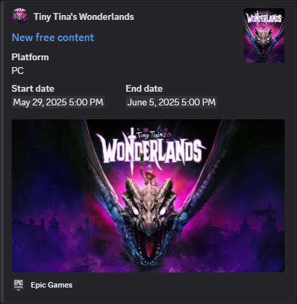

_**Last Updated**: June 2, 2025_

# Introduction

_Sgt. Bot_ is a _Discord_ application that periodically sends event messages about video games platforms and
communities.
It can be fully customized using commands to only receive messages about desired events, games and players.

Some examples of messages:

# Getting Started

- First, you need to add _Sgt. Bot_ to your _Discord_ server. You can invite him by
  clicking [here](https://discord.com/oauth2/authorize?client_id=1123539193503694898).
- Then to start receiving event messages, you have to subscribe to a channel. This can be done using the following
  command in the desired channel:
	- `/channel-subscribe`

That is all! Next time _Sgt. Bot_ will send event messages, you will receive default ones in that channel.

If you want to better configure _Sgt. Bot_, you can see some _[examples](#examples)_ below.

If you have an issue, please check the _[troubleshooting](#troubleshooting)_ section of this page or join
our [support server](https://discord.gg/gFUm33Mh9d).

# Events

Here is a list of all available events that can be enabled/disabled per subscribed channel:

| Name                                  | Description                                                                                                    | Enabled by Default | Related Games                                             |
|---------------------------------------|----------------------------------------------------------------------------------------------------------------|--------------------|-----------------------------------------------------------|
| `ApplicationAnnouncements`            | Send messages about new announcements from _Sgt. Bot_.                                                         | Yes                | None                                                      |
| `SteamAnnouncements`                  | Send messages about new announcements from _Steam Blog_, _Steam Store_, _SteamVR_ and _Steam Deck_ on _Steam_. | No                 | None                                                      |
| `SteamGamesFreePromotions`            | Send messages about games being temporary free to keep forever on _Steam_.                                     | Yes                | Any                                                       |
| `SteamGamesHistoricalLowPrices`       | Send messages about games having new historical low prices on _Steam_.                                         | Yes                | Only _Steam_ games wanted by registered players           |
| `SteamGamesAnnouncements`             | Send messages about games having new announcements on _Steam_.                                                 | No                 | Only _Steam_ games owned and wanted by registered players |
| `SteamGamesAddOns`                    | Send messages about games having added or removed add-ons on _Steam_.                                          | Yes                | Only _Steam_ games owned and wanted by registered players |
| `SteamGamesAchievements`              | Send messages about games having added or removed achievements on _Steam_.                                     | Yes                | Only _Steam_ games owned and wanted by registered players |
| `SteamPlayersGamesCompletions`        | Send messages about players having completed games by earning all their achievements on _Steam_.               | Yes                | Only _Steam_ games owned by registered players            |
| `EpicGamesGamesFreePromotions`        | Send messages about games being temporary free to keep forever on _Epic Games_.                                | Yes                | Any                                                       |
| `GogGamesFreePromotions`              | Send messages about games being temporary free to keep forever on _GOG_.                                       | Yes                | Any                                                       |
| `TwitchGamesDropsAndRewardsCampaigns` | Send messages about new drops and rewards campaigns on _Twitch_.                                               | Yes                | Any/None                                                  |
| `AmazonGamingGamesFreePromotions`     | Send messages about games being temporary free to keep forever on _Prime Gaming_.                              | No                 | Any                                                       |
| `DiscordGamesQuests`                  | Send messages about new quests on _Discord_.                                                                   | Yes                | Any                                                       |

# Games

Some events are associated with a game, for these you can include/exclude games in a subscribed channel. By default,
every game is included.

When a specific game is included/excluded, most of the time this applies for every source (e.g. _Steam_, _Twitch_…).
However, sometimes _Sgt. Bot_ is not able to unify the same game across multiple sources. In that case when
including/excluding the game, it may appear multiple times and eventually with the source in parentheses.

Example:
- `Payday 2` (every source but _Twitch_)
- `PAYDAY 2 (Twitch)`: (only the _Twitch_ source)

# Players

A player is a _Discord_ member of your server.

Some events are based on players such as `SteamPlayersGamesCompletions`, or on their games such as
`SteamGamesAnnouncements`. In order for them to work on your server, you need to register at least one player. _Steam_
events require players to have their _Steam_ identifier registered.

More information about how to get a _Steam_ identifier can be
found [here](https://help.steampowered.com/faqs/view/2816-BE67-5B69-0FEC).

Note that this may require the _Steam_ profile privacy to be stated as public,
see [here](https://help.steampowered.com/faqs/view/588C-C67D-0251-C276).

# Commands

When you invite _Sgt. Bot_, it creates those commands on your server:

| Name                     | Description                                                | Parameters             | Scope   | Default Permission |
|--------------------------|------------------------------------------------------------|------------------------|---------|--------------------|
| `/channels`              | Display subscribed channels.                               |                        | Server  | Member             |
| `/channel-subscribe`     | Subscribe the current channel.                             |                        | Channel | Administrator      |
| `/channel-unsubscribe`   | Unsubscribe the current channel.                           |                        | Channel | Administrator      |
| `/channel-events`        | Display enabled or disabled events in the current channel. |                        | Channel | Member             |
| `/channel-event-enable`  | Enable an event (or all events) in the current channel.    | `event`                | Channel | Administrator      |
| `/channel-event-disable` | Disable an event (or all events) in the current channel.   | `event`                | Channel | Administrator      |
| `/channel-games`         | Display included or excluded games in the current channel. |                        | Channel | Member             |
| `/channel-game-include`  | Include a game (or all games) in the current channel.      | `game`                 | Channel | Administrator      |
| `/channel-game-exclude`  | Exclude a game (or all games) in the current channel.      | `game`                 | Channel | Administrator      |
| `/players`               | Display registered players.                                |                        | Server  | Member             |
| `/player-register`       | Register a player.                                         | `player`, (`steam-id`) | Server  | Administrator      |
| `/player-unregister`     | Unregister a player.                                       | `player`               | Server  | Administrator      |

# Examples

## How to configure _Sgt. Bot_ to only receive messages about historical low prices for games I want on _Steam_?

- First, subscribe to the channel where you want to receive event messages:
	- `/channel-subscribe`

- Suppose your _Discord_ user is `Gabe Newell#1234` and your _Steam_ identifier is `76561197960287930`, then register
  you as a player so that _Sgt. Bot_ will be able to track games you want:
	- `/player-register player:@Gabe Newell#1234 steam-id:76561197960287930`

- Because you do not want to receive messages about every event, disable them all before enabling only the event you are
  interested in:
	- `/channel-event-disable event:(all)`
	- `/channel-event-enable event:SteamGamesHistoricalLowPrices`

Done! You will now save some money by only buying _Steam_ games at the best prices!

## How to configure _Sgt. Bot_ to only receive messages about drops for the _PAYDAY 2_ game on _Twitch_?

- First, subscribe to the channel where you want to receive event messages:
	- `/channel-subscribe`

- To include only the _PAYDAY 2_ game, you need to exclude them all and then include only the desired game:
	- `/channel-game-exclude game:(all)`
	- `/channel-game-include game:Payday 2`

- Because you do not want to receive messages about every event, disable them all before enabling only the event you are
  interested in:
	- `/channel-event-disable event:(all)`
	- `/channel-event-enable event:TwitchGamesDropsAndRewardsCampaigns`

Done, you will not forget anymore to watch _Twitch_ streams to get some cool masks to flex with in your favorite game!

# Troubleshooting

## I have subscribed a channel to _Sgt. Bot_, but I do not receive any message

- Ensure that at least one event is enabled and that games are included correctly:
	- `/channel-events`
	- `/channel-games`

- Check that _Sgt. Bot_ has enough permissions, at least:
	- `View Channel`
	- `Send Messages`/`Send Messages in Threads`
	- `Embed Links`

After that, if you still do not receive any event message from _Sgt. Bot_, that may be because none has been sent since.
Eventually, in that case you will have to wait.

# Credits

- _Sgt. Bot_ is powered by _[JDA](https://jda.wiki)_
- Games are unified across several sources thanks to _[IGDB](https://igdb.com)_
- _Steam_ historical low prices are provided by _[IsThereAnyDeal](https://isthereanydeal.com)_

# Links

- _[Terms of Service](TERMS.md)_
- _[Privacy Policy](PRIVACY.md)_
- _[Support server](https://discord.gg/gFUm33Mh9d)_